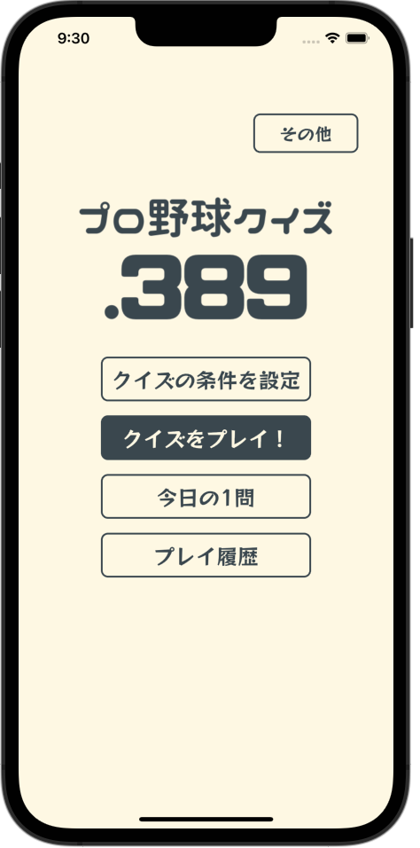
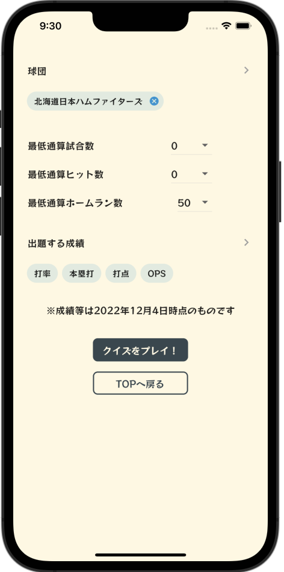
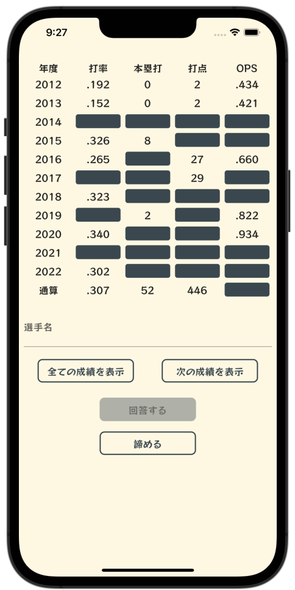
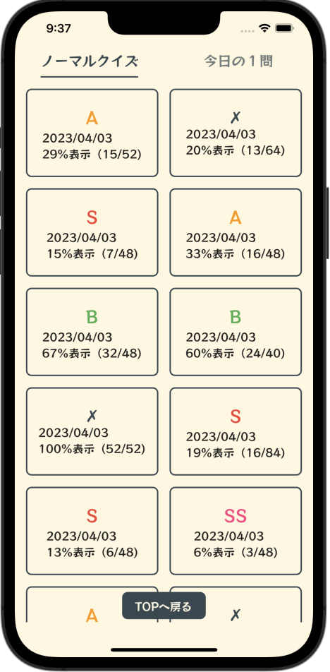
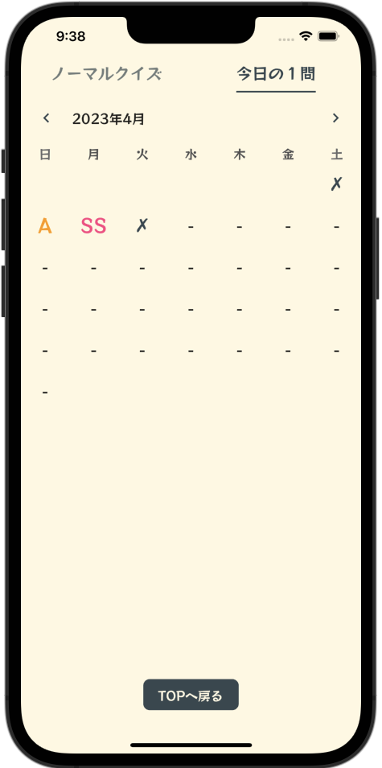
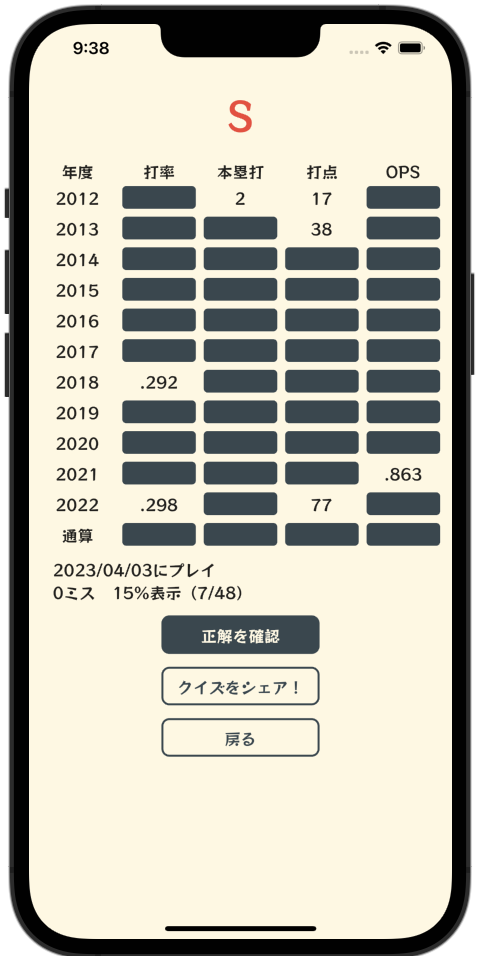

# .389 / プロ野球クイズ

.389 / プロ野球クイズは、NPBに所属している野手の成績クイズが楽しめるモバイルアプリです。  
インストールは以下リンクから行えます。

[App Store](https://apps.apple.com/jp/app/1668555651)  
[Google Play Store](https://play.google.com/store/apps/details?id=com.toda.baseball_quiz_app)


# スクリーンショット

| TOP | クイズ設定 | 
| ---- | ---- | 
|  |  | 

| クイズプレイ | クイズ結果 | 
| ---- | ---- | 
|  |  | 

| 履歴リスト（通常） | 履歴リスト（デイリー） | 
| ---- | ---- | 
|  |  | 

| 履歴詳細（通常） | 
| ---- | 
|  | 

# 主な機能

## 成績クイズ

NPBに所属している野手の成績クイズをプレイすることができます。  

クイズには、通常のクイズ、デイリークイズ（今日の1問）の2種類があり、それぞれ次のような仕様となっています。

- 通常のクイズ
  - プレイヤーが設定した条件に合致する選手の問題が出題されます
  - プレイヤーは何度でも間違えることができます。

- デイリークイズ（今日の1問）
  - 運営者が日替わりで出題選手を設定します（日毎に出題される選手は全プレイヤー共通です）
  - プレイヤーは1日に1回だけプレイすることができ、3回間違えると不正解となります。

また、どちらのクイズも、最初は成績が伏せられた状態でスタートし、徐々に成績を表示することができます。  
※表示される成績はランダムです。

<!-- TODO gifをはる -->

## プレイしたクイズ履歴の確認

プレイヤーは、過去にプレイしたクイズの結果を確認することができます。  
※アプリのバージョンが1.2.0以降の状態でプレイしたクイズに限ります。

<!-- TODO gifをはる -->

# ディレクトリ構成

ディレクトリ構成は以下です。

<pre>
.
├── common_widget
├── feature
│   ├── admob
│   ├── app_info
│   ├── auth
│        .
│        .
│        .        
├── main.dart
└── util
</pre>

簡単に各ディレクトの説明をさせていただきます。

## common_widget

ダイアログ等、様々なfeatureで横断的に使用されるwidgetを定義しています。  

## feature

以下記事を参考にさせていただきました。  
https://codewithandrea.com/articles/flutter-project-structure/

featureの配下には、auth, quiz, search_conditionといった機能（関心）毎にディレクトを作成しており、  
それらのディレクトリの配下には必要に応じて以下ディレクトリを作成しています。

- application
- domain
- infrastructure
- presentation
- util

## util

例外やロガー、定数などを定義しています。

# 使用技術

## Flutter

以下環境を使用しています。

```sh
Flutter 3.7.5 • channel stable • https://github.com/flutter/flutter.git
Framework • revision c07f788888 (6 weeks ago) • 2023-02-22 17:52:33 -0600
Engine • revision 0f359063c4
Tools • Dart 2.19.2 • DevTools 2.20.1
```

## Firebase

以下を使用しています。  

- Authentication: 匿名認証の実装に使用
- Cloud Firestore: 各ユーザーのプレイ履歴等の保存に使用
- Analytics
- Crashlytics

Cloud Firestoreについては、Security Rulesやテストを別リポジトリで管理しています。

## Supabase

Databaseを使用しています。  
スクレイピングで取得した選手成績をRDBに保存したかったため使用しています。

## Python

アプリ内で使用する選手成績のスクレイピングをPythonで実装しています。  
スクレイピングのソースは別リポジトリで管理しています。

## GitHub Actions

CI/CDの構築に使用しています。  
CIは、developブランチへのPull Request作成時とPush時に、静的解析とテストの実行が行われるようにしています。  
CDは、masterブランチへのPull Request作成時とPush時に、App Store Connectへのアップロードが行われるようにしています。

# その他

## 主な使用パッケージ

- flutter_riverpod
- freezed
- hive

## ブランチ運用

git-flowを採用しています。

# おわりに

本リポジトリを見ていただき、ありがとうございます！  

また、本アプリを開発するにあたり、様々な記事やリポジトリ、書籍、動画を参考にさせていただきました。  
発信してくださっている方々には心から感謝しています。  
本当にありがとうございました！
